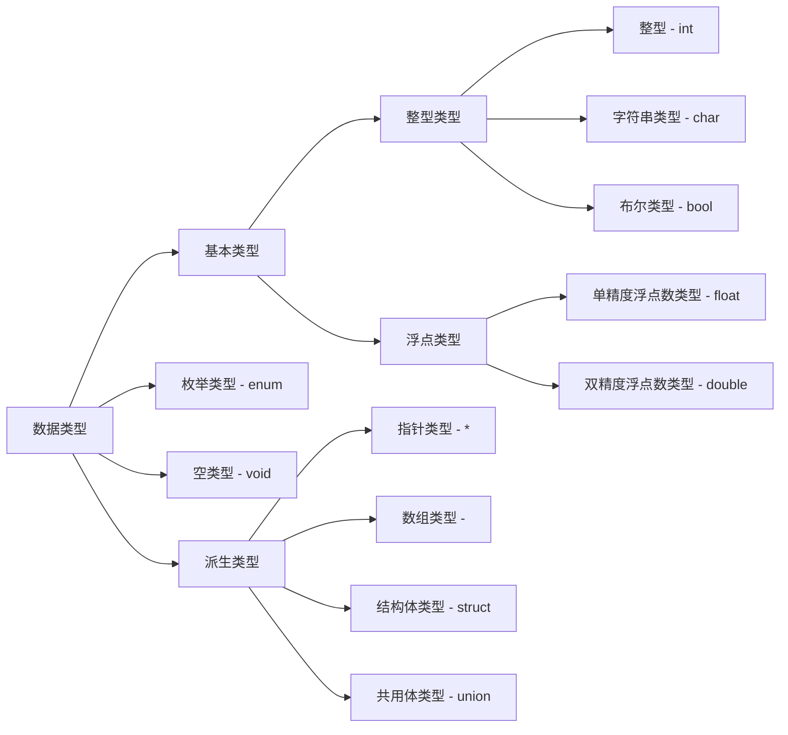

# 数据类型



## 整型

在 C 中整型变量用`int`来声明。如果需要可以更改变量的字节数，定义**长整形**或**短整形**，只需要在类型前面加上修饰词`long`或`short`即可。

有些情况下，变量的值通常为正的（如学号、年龄、库存量等）。为了充分使用变量的数值的范围，可以使整型变量的储存单元的首位不存储数值符号，而将全部的二进制位来存储数值本身。这样可以使得存储数值的范围扩大一倍，此时存储的值都是无符号的。可以在类型前面加修饰词`unsigned`来指定变量为无符号的整型变量。也可以加修饰词`signed`表示为有符号的（`int` 类型默认为有符号的）。

C 标准里没有具体规定以上各种数据所占内存的字节数，只要求`long int`类型数据长度不短与`int`类型，`short int`类型数据长度不长与`int`类型。目前通常的做法是：把`long`定在 32 位，`short`定在 16 位，`int`可以是 16 位，也可以是 32 位。

因此可以使用的整数类型有：

- `int`： 基本整型
- `long int`： 长整型
- `short int`： 短整型
- `signed int`： 有符号整型
- `unsigned int`： 无符号整型
- `signed short int`：有符号短整型
- `unsigned short int`：无符号短整型
- `signed long int`：有符号长整型
- `unsigned long int`：无符号长整型
- `long long int`：双长整型
- `unsigned long long int`：无符号双长整型

通过`sizeof`方法可以查询系统对变量分配对空间，如：

```c
#include <stdio.h>

int main() {
    printf("%d int\n", sizeof(int)); // 4 int
    printf("%d long int\n", sizeof(long int)); // 8 long int
    printf("%d short int\n", sizeof(short int)); // 2 short int
    printf("%d signed int\n", sizeof(signed int)); // 4 signed int
    printf("%d unsigned int\n", sizeof(unsigned int)); // 4 unsigned int
    printf("%d signed short int\n", sizeof(signed short int)); // 2 signed short int
    printf("%d unsigned short int\n", sizeof(unsigned short int)); // 2 unsigned short int
    printf("%d signed long int\n", sizeof(signed long int)); // 8 signed long int
    printf("%d unsigned long int\n", sizeof(unsigned long int)); // 8 unsigned long int
    printf("%d long long int\n", sizeof(long long int)); // 8 long long int
    printf("%d unsigned long long int\n", sizeof(unsigned long long int)); // 8 unsigned long long int
    return 0;
}
```

### 表现形式

C 语言中，整型可以用以下三种形式表示：

- 十进制：如 123，-234。
- 八进制：以 0 开头的数都被认为八进制数。如 0123 表示八进制数 123，即(123)~8~，等于十进制数 83。
- 十六进制：以 0x 开头的数都被认作十六进制数。如 0x123 代表十六进制数 123，即(123)~16~，等于而进制数 291。

### 常量类型

整型常量在字面上可以决定它是什么类型的，如果`short`型数据在内存中占 2 字节，`int`和`long int`型数据占 4 字节，按照以下规则处理：

1. 在-32768~32767 范围内，为`short`型，分配 2 字节。可以赋值给`short`, `int`和`long int`。
2. 超出上述范围，而在-2147483648~2147483647 范围内，则为整型，分配 4 字节。可赋值给`int`或`long int`型变量
3. 在整型常量后面加一个字母`l`或`L`则认为是`long int`型常量，如 123l、432L 等。
4. 在整数常量后面加一个字母`u`或`U`则认为是`unsigned int`型常量，如 12345u。

## 浮点数

浮点数在 C 中有两种表现形式：

1. 十进制小数：由数字和小数点组成。
2. 指数形式：在数学上，类似于 123 $\times$ 10^3^这样的形式成为指数形式。在计算机的字符中无法表示上标和下标，所以用字母**e**或**E**来表示以 10 为底的指数。例如用 123e3 或 123E3 来表示 123 $\times$ 10^3^，但是字母 e 或 E 之前必须有数字，且 e 后面的指数必须为整数，如 `e3, .e3, 2e` 都是不合法的指数形式。

浮点数变量分为 3 类：

- `float`： 单精度浮点数
- `double`： 双精度浮点数
- `long double`： 长双精度浮点数

## 字符串

在 C 中字符串类型用`char`来声明，C 里面字符串分为字符常量和字符变量。

- 转义字符：用来作为输出信息时的控制符号（如换行、退格等），转义字符通常用`\`开头，`\`后面的字符转换成另外的意义。如`\n`代表换行符。
- 字符常量：字符常量通常使用单撇号括起来的**一个**字符，如`'a'`。
- 字符变量：字符变量用来存放字符常量，它只能存放一个字符（不能储存**字符串** - 若干个字符）。
  > 在所有的编译系统中都规定以一字节来存放一个字符，字符数据是以 ASCII 码储存的。
- 字符串变量：字符串常量是一对双撇号括起来的字符序列，如`"Hello World"`。如果将字符串存放在内存中，必须使用**字符数组**。
  > `'a'`和`"a"`的区别在于，C 语言编译系统在处理字符串时，会在每个字符串变量的结尾加入一个字符`\0`来表示字符串的结束，`\0`是一个 ASCII 码为 0 的字符。

## 符号常量

用**符号**来代表一个常量这种成为符号常量。符号常量只是一个**符号**，不占用储存单元，它只是简单的将字符置换。符号常量的声明方式如下：

```c
#define PI 3.1415926
```

`#define`只是一个“预编译指令”。符号常量只是符号，不是变量，不能对其赋值，也不能对其指定类型。
